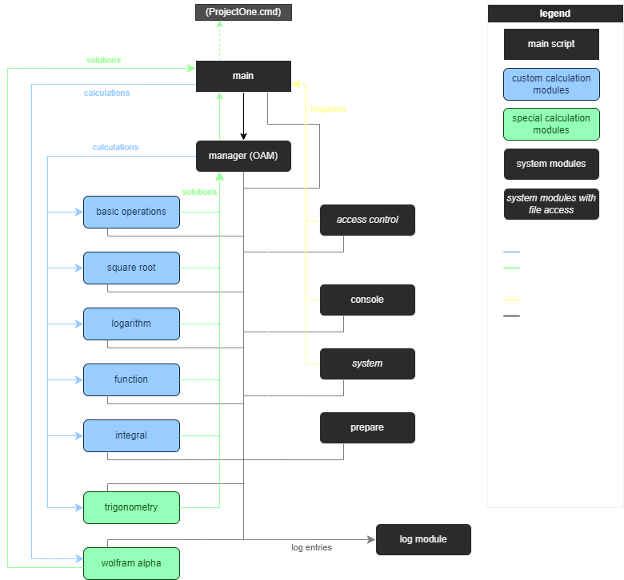

# Project One


---

**Project One** is a complex programme with many different functions. The majority of these are the calculation functions. These are spread over several modules and are grouped together under the name Master Math. Project One has a number of other features such as a system console, log files, settings and many more.

**Master Math** is a Python-based educational project that can solve a wide variety of fundamental and complex mathematical problems. It is designed to be used as intuitively as possible and can solve and calculate functions, integrals, logarithms, roots and other mathematical tasks. The system can also calculate with constants such as pi or e.

---

## Table of Contents
- [Features](#features)
- [Installation](#installation)
- [Usage](#usage)
- [Requirements](#requirements)
- [Project Structure](#project-structure)
- [Contributing](#contributing)

---

## Features

Project One offers a range of tools and functionalities, including:
- **Basic Mathematical Operations**: Addition, subtraction, multiplication, division, modulo and power.
- **Advanced Calculations**: square roots, calculate zeros of functions, integrals, and logarithms.
- **Customizable Settings**: Your preferences are stored in a config file, which saves your choices when you close the program.
- **Built-in Console**: An integrated console for quick access to settings, help and information.

## Installation

To set up Project One on your computer:

1. **Clone the repository**:
   (or download it as a ZIP file)
   ```bash
   git clone https://github.com/burk-manu/ProjectOne.git

3. **Run the Programme**:  
   Run the ProjectOne.cmd file or if you can't do this run main.py.
   
4. **Complete Set-Up**:  
Follow the instructions in the user guide file which opens after starting the programme.

## Usage
Once you've installed Project One on your computer, run Main.py and follow the instructions.
If you need help, make sure you are connected to the internet.
Then type 'help', this command will open a document in your browser.

## Requirements
To run or develop this project, you should ensure that your system has the following requirements.
If you are not sure whether your system has the necessary requirements, you can run the programme. Then follow the instructions to ensure the functionality of the programme.

**Requirements:**
- **Operating System**: Windows 11 (recommended: other operating systems may causes errors)
- **Programming Language**: Python 3.10
- **Integrated Development Environment (IDE)**: Visual Studio Code or use cmd instead
- **Libraries**:
  - sympy
  - math
  - datetime
  - time
  - sys
  - os
  - colorama
  - re
  - webbrowser
  - json
  - shutil

## Project Structure


## Contributing
As this project is for educational purposes only and is part of a school project, no contributions are requested or expected. The project is not intended for public or collaborative development outside the scope of the school project. Therefore, external contributions are **not desired** at this time.

Please feel free to view or use the project for personal or educational purposes only, in accordance with the licence terms.


<footer>

---

Get help: [Contact developer](mailto:ProjectOne@gmx.ch) &bull; [Review the GitHub status page](https://www.githubstatus.com/)

&copy; 2024 Manuel Bürki &bull; [Code of Conduct](https://www.contributor-covenant.org/version/2/1/code_of_conduct/code_of_conduct.md) &bull; [License](LICENSE.md)

</footer>